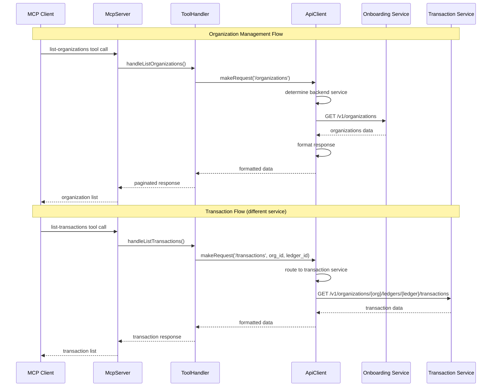
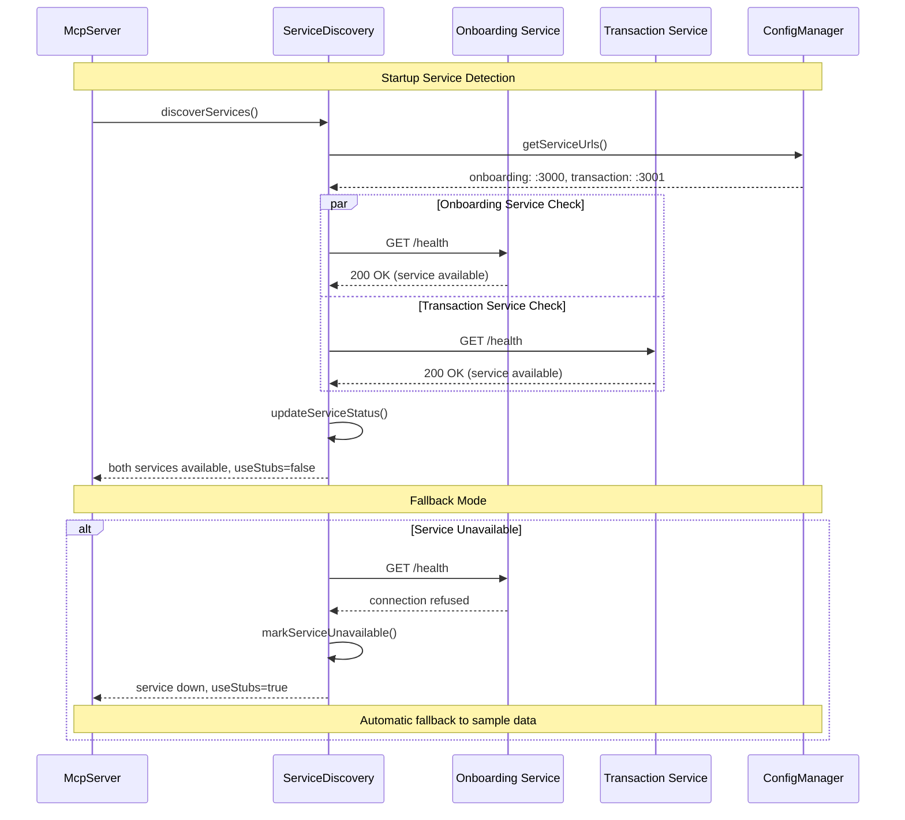
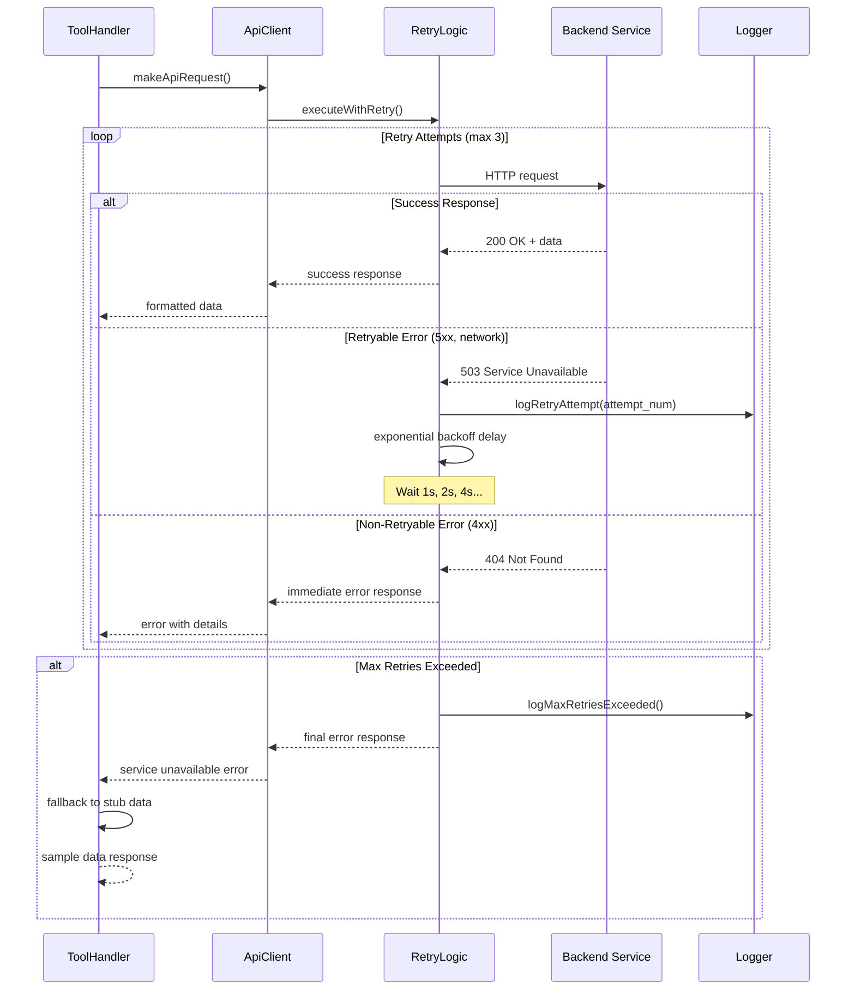
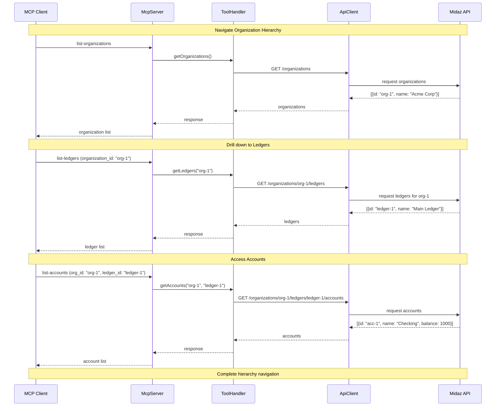
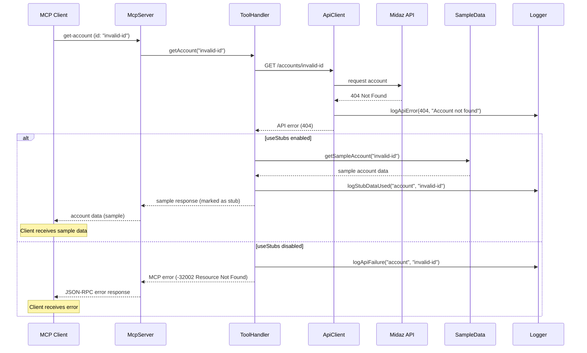
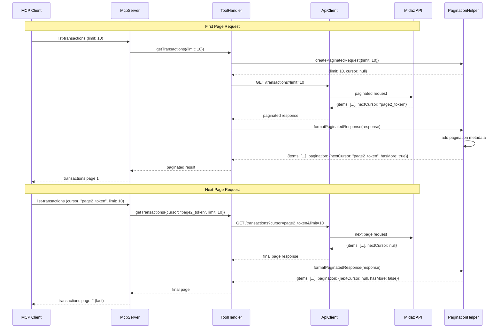
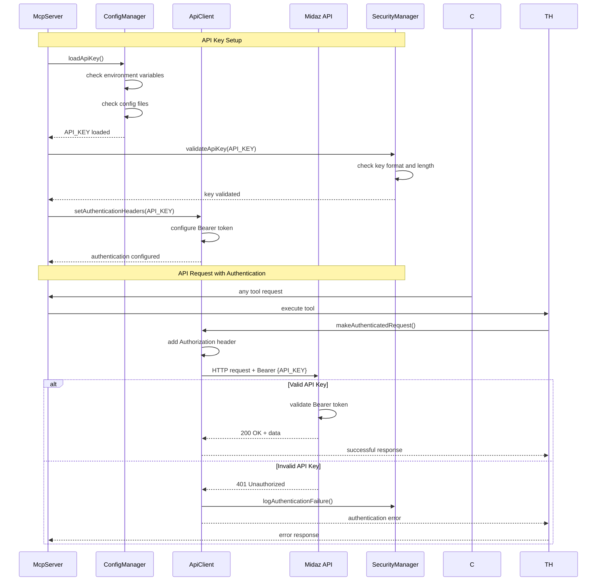

# API Flow Diagrams

## Midaz Backend Integration Flow

## Service Auto-Detection Flow

## API Request with Retry Logic

## Hierarchical API Navigation

## API Error Handling and Fallback

## Paginated API Response Flow

## Authentication and API Key Management

