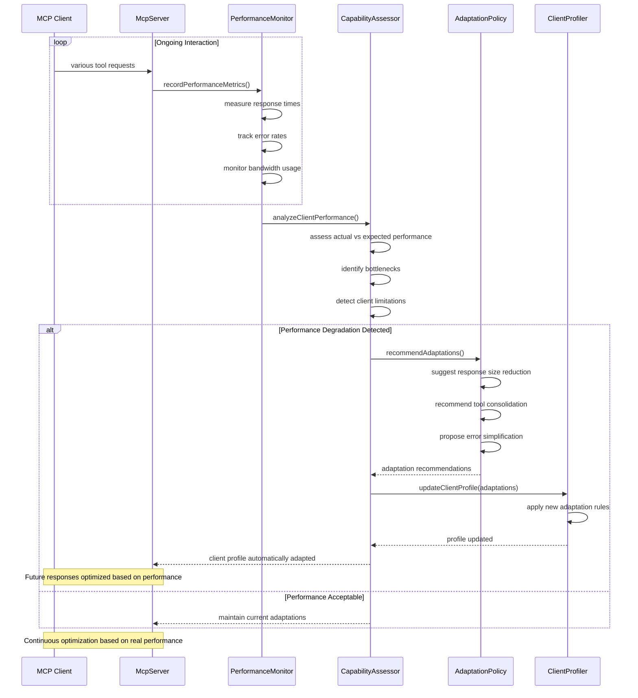

# Client Adaptation Flow Diagrams

## Client Detection and Profiling

```mermaid
sequenceDiagram
    participant C as MCP Client
    participant S as McpServer
    participant CD as ClientDetector
    participant CA as ClientAnalyzer
    participant CP as ClientProfiler
    participant CM as ConfigManager
    
    Note over C,CM: Initial Client Connection
    C->>S: stdio connection established
    S->>CD: detectClient(connection)
    CD->>CD: analyze transport characteristics
    CD->>CD: extract client information
    CD-->>CA: client metadata
    
    CA->>CA: identify client type
    CA->>CA: determine version
    CA->>CA: assess capabilities
    CA-->>CP: client analysis
    
    CP->>CP: create client profile
    CP->>CP: set capability flags
    CP->>CP: configure adaptation rules
    CP->>CM: storeClientProfile(client_id, profile)
    CM-->>CP: profile stored
    
    CP-->>S: {
        clientType: "claude-desktop",
        version: "1.2.3",
        capabilities: {
            resources: false,
            tools: true,
            prompts: true,
            maxResponseSize: 32768
        },
        adaptations: {...}
    }
    S-->>C: connection configured for client
```

## Dynamic Response Adaptation

```mermaid
sequenceDiagram
    participant C as MCP Client
    participant S as McpServer
    participant TH as ToolHandler
    participant RA as ResponseAdapter
    participant CF as ContentFilter
    parameter SF as SizeFormatter
    participant CP as ClientProfiler
    
    C->>S: list-organizations (large dataset)
    S->>TH: getOrganizations()
    TH->>TH: fetch full dataset (1000+ organizations)
    TH-->>S: complete response (large)
    
    S->>RA: adaptResponse(response, client_id)
    RA->>CP: getClientProfile(client_id)
    CP-->>RA: {
        maxResponseSize: 32768,
        supportedFormats: ["text", "json"],
        limitedBandwidth: true
    }
    
    RA->>SF: checkResponseSize(response)
    SF-->>RA: size: 128KB (exceeds limit)
    
    RA->>RA: apply size reduction
    RA->>RA: truncate to top 50 results
    RA->>RA: add pagination metadata
    
    RA->>CF: filterContent(response, clientCapabilities)
    CF->>CF: remove unsupported content types
    CF->>CF: simplify complex objects
    CF-->>RA: filtered response
    
    RA-->>S: {
        items: [...50 items...],
        pagination: {
            truncated: true,
            totalCount: 1000,
            nextCursor: "page_2_token"
        },
        adaptations: {
            sizeReduced: true,
            contentFiltered: true
        }
    }
    S-->>C: optimized response for client
```

## Tool Availability Adaptation

```mermaid
sequenceDiagram
    participant C as MCP Client
    participant S as McpServer
    participant TA as ToolAdapter
    participant TR as ToolRegistry
    parameter CP as ClientProfiler
    participant TF as ToolFilter
    
    C->>S: tools/list request
    S->>TA: getAvailableTools(client_id)
    TA->>CP: getClientProfile(client_id)
    CP-->>TA: {
        clientType: "vscode-extension",
        capabilities: {
            maxTools: 15,
            complexSchemas: false,
            unifiedTools: true
        }
    }
    
    TA->>TR: getAllTools()
    TR-->>TA: 21 tools available
    
    TA->>TF: filterToolsForClient(tools, clientCapabilities)
    
    alt Limited Tool Support
        TF->>TF: prioritize unified tools
        TF->>TF: combine related tools
        TF->>TF: simplify complex schemas
        TF-->>TA: 15 adapted tools
    else Full Tool Support  
        TF-->>TA: all 21 tools
    end
    
    TA->>TA: add client-specific descriptions
    TA->>TA: adjust parameter hints
    TA-->>S: adapted tool list
    S-->>C: tools optimized for client
    
    Note over C,S: Tools adapted to client limitations
```

## Parameter Simplification Flow

```mermaid
sequenceDiagram
    participant C as MCP Client
    participant S as McpServer
    participant TH as ToolHandler
    participant PS as ParameterSimplifier
    participant VS as ValidationSimplifier
    participant CP as ClientProfiler
    
    C->>S: docs-unified tool call (complex parameters)
    S->>TH: handleDocsUnified(args)
    TH->>CP: getClientProfile(client_id)
    CP-->>TH: {
        complexSchemas: false,
        preferSimpleTypes: true,
        maxParameterDepth: 2
    }
    
    TH->>PS: simplifyParameters(args, clientProfile)
    PS->>PS: flatten nested objects
    PS->>PS: convert complex types to strings
    PS->>PS: remove optional advanced parameters
    PS-->>TH: simplified parameters
    
    TH->>VS: validateSimplified(simplifiedArgs)
    VS->>VS: apply basic validation rules
    VS->>VS: skip complex business logic checks
    VS-->>TH: validation passed
    
    TH->>TH: execute with simplified parameters
    TH-->>S: tool result
    S-->>C: response with simplified interaction
    
    Note over C,S: Complex tool made accessible to simple client
```

## Error Message Adaptation

```mermaid
sequenceDiagram
    participant C as MCP Client
    participant S as McpServer
    participant TH as ToolHandler
    participant EA as ErrorAdapter
    participant EM as ErrorMapper
    participant CP as ClientProfiler
    
    TH->>TH: tool execution fails
    TH-->>S: complex error object
    S->>EA: adaptError(error, client_id)
    EA->>CP: getClientProfile(client_id)
    CP-->>EA: {
        clientType: "cli-tool",
        errorDetailLevel: "minimal",
        preferPlainText: true
    }
    
    EA->>EM: mapErrorForClient(error, profile)
    
    alt Technical Client (IDE/CLI)
        EM->>EM: preserve error codes
        EM->>EM: include stack traces
        EM->>EM: add debugging information
        EM-->>EA: detailed technical error
    else User-Facing Client (Desktop App)
        EM->>EM: simplify error message
        EM->>EM: remove technical details
        EM->>EM: add user-friendly suggestions
        EM-->>EA: simplified user error
    else Limited Client (Mobile/Web)
        EM->>EM: create minimal error
        EM->>EM: focus on action items
        EM->>EM: reduce message length
        EM-->>EA: concise error message
    end
    
    EA-->>S: adapted error response
    S-->>C: client-appropriate error
    
    Note over C,S: Error complexity matches client sophistication
```

## Bandwidth Optimization Flow

```mermaid
sequenceDiagram
    participant C as MCP Client
    participant S as McpServer
    participant TH as ToolHandler
    participant BO as BandwidthOptimizer
    participant CC as CompressionController
    participant CP as ClientProfiler
    
    C->>S: get-transaction-history (large dataset request)
    S->>TH: getTransactionHistory()
    TH->>TH: fetch comprehensive data
    TH-->>S: full response (256KB)
    
    S->>BO: optimizeForBandwidth(response, client_id)
    BO->>CP: getClientProfile(client_id)
    CP-->>BO: {
        connectionType: "mobile",
        bandwidthLimited: true,
        compressionSupported: true,
        preferSummaries: true
    }
    
    alt Low Bandwidth Client
        BO->>BO: create summary version
        BO->>BO: remove detailed metadata
        BO->>BO: compress timestamp formats
        BO->>BO: truncate description fields
        BO->>CC: compressResponse(summaryData)
        CC-->>BO: compressed response (32KB)
    else High Bandwidth Client
        BO->>CC: compressResponse(fullData)
        CC-->>BO: compressed response (128KB)
    end
    
    BO-->>S: optimized response
    S-->>C: bandwidth-appropriate data
    
    Note over C,S: Response size adapted to connection quality
```

## Real-time Capability Assessment



## Feature Discovery and Negotiation

```mermaid
sequenceDiagram
    participant C as MCP Client
    participant S as McpServer
    participant FD as FeatureDetector
    participant FN as FeatureNegotiator
    participant CP as ClientProfiler
    parameter TC as ToolCustomizer
    
    Note over C,TC: Initial Feature Detection
    C->>S: initialize request with capabilities
    S->>FD: detectFeatures(clientCapabilities)
    FD->>FD: parse capability declarations
    FD->>FD: test feature support
    FD-->>FN: detected capabilities
    
    FN->>FN: compare with server features
    FN->>FN: identify compatibility gaps
    FN->>FN: negotiate optimal feature set
    FN-->>CP: negotiated feature profile
    
    CP->>TC: customizeTools(negotiatedFeatures)
    TC->>TC: enable/disable features
    TC->>TC: modify tool schemas
    TC->>TC: adjust response formats
    TC-->>CP: tools customized
    
    CP-->>S: client profile with negotiated features
    S-->>C: server configured for optimal compatibility
    
    Note over C,TC: Ongoing Feature Adaptation
    alt Client Upgrades
        C->>S: new capabilities announced
        S->>FN: renegotiateFeatures()
        FN->>CP: updateClientProfile()
        CP->>TC: enableNewFeatures()
        TC-->>S: enhanced tools available
        S-->>C: upgraded feature set
    else Client Limitations Discovered
        S->>FD: detectLimitations(errorPatterns)
        FD->>FN: adjustCapabilities()
        FN->>CP: restrictFeatures()
        CP->>TC: simplifyTools()
        TC-->>S: reduced complexity
        S-->>C: fallback to simpler interface
    end
```