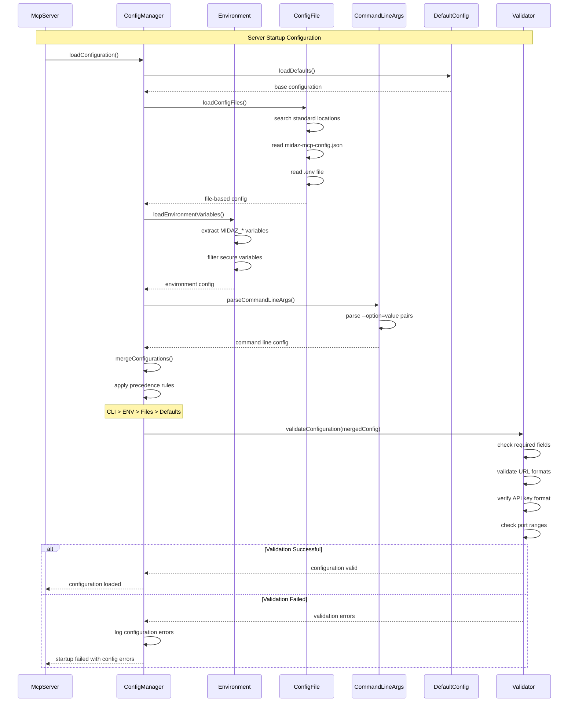
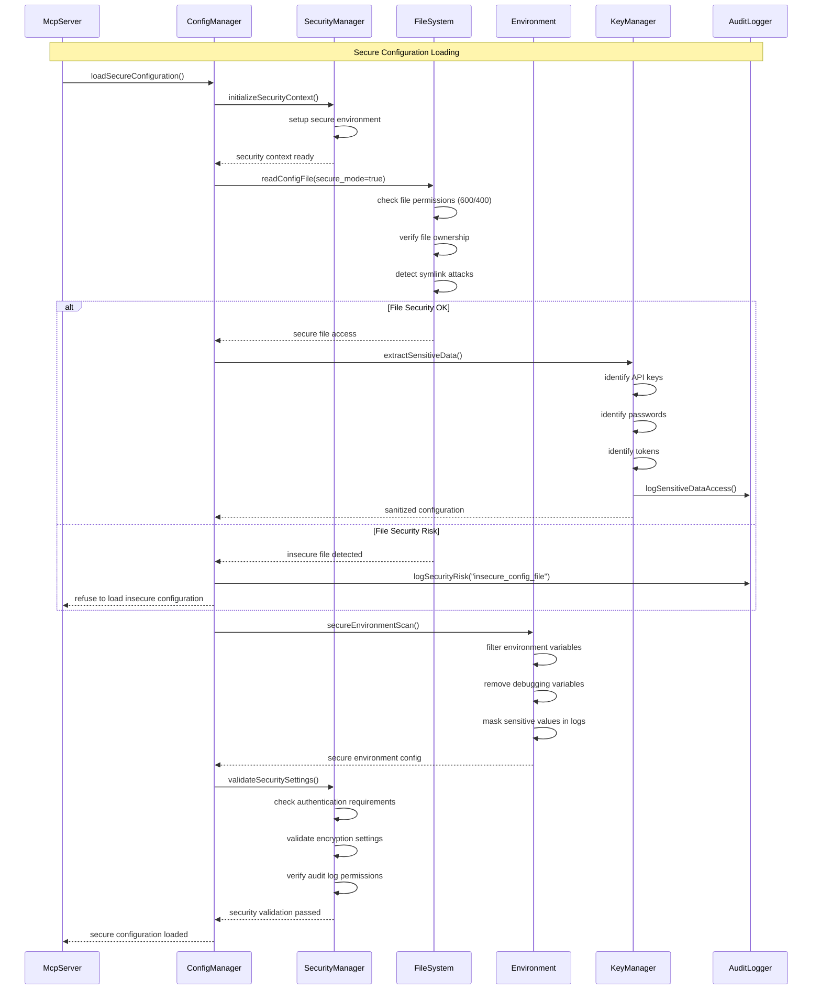
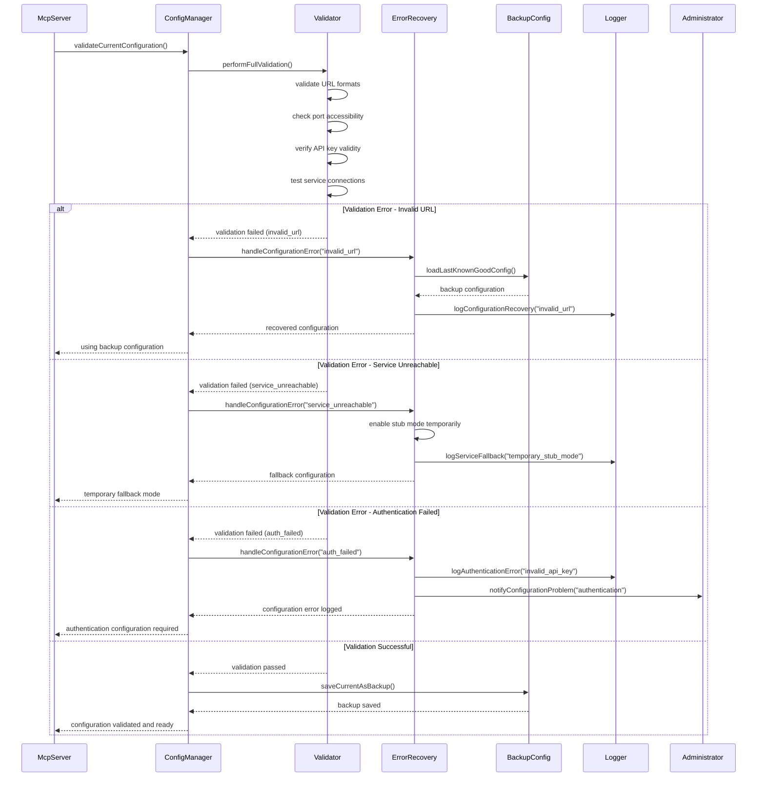

# Configuration and Service Discovery Flow Diagrams

## Multi-Source Configuration Loading



## Service Discovery and Health Checking

```mermaid
sequenceDiagram
    participant S as McpServer
    participant SD as ServiceDiscovery
    participant HM as HealthMonitor
    participant OS as Onboarding Service
    participant TS as Transaction Service
    participant CM as ConfigManager
    participant L as Logger
    
    S->>SD: discoverServices()
    SD->>CM: getServiceUrls()
    CM-->>SD: {
        onboarding: "http://localhost:3000",
        transaction: "http://localhost:3001"
    }
    
    par Health Check Onboarding Service
        SD->>HM: checkHealth("onboarding")
        HM->>OS: GET /health
        alt Service Available
            OS-->>HM: 200 OK {"status": "healthy"}
            HM->>L: logServiceHealth("onboarding", "healthy")
            HM-->>SD: onboarding service available
        else Service Unavailable
            OS-->>HM: connection refused
            HM->>L: logServiceHealth("onboarding", "unavailable")
            HM-->>SD: onboarding service down
        end
    and Health Check Transaction Service
        SD->>HM: checkHealth("transaction")
        HM->>TS: GET /health
        alt Service Available
            TS-->>HM: 200 OK {"status": "healthy"}
            HM->>L: logServiceHealth("transaction", "healthy")
            HM-->>SD: transaction service available
        else Service Unavailable
            TS-->>HM: connection refused
            HM->>L: logServiceHealth("transaction", "unavailable")
            HM-->>SD: transaction service down
        end
    end
    
    SD->>SD: evaluateServiceAvailability()
    
    alt All Services Available
        SD->>CM: setStubMode(false)
        SD-->>S: services ready, live mode enabled
    else Some Services Down
        SD->>CM: setStubMode(true)
        SD-->>S: fallback to stub mode
    else All Services Down
        SD->>CM: setStubMode(true)
        SD->>L: logCritical("all_services_unavailable")
        SD-->>S: operating in full stub mode
    end
```

## Dynamic Configuration Updates

```mermaid
sequenceDiagram
    participant A as Admin/Client
    participant S as McpServer
    participant CM as ConfigManager
    parameter WM as WatchManager
    participant CF as ConfigFile
    participant VAL as Validator
    participant SR as ServiceRegistry
    
    Note over A,SR: Configuration File Change
    A->>CF: update midaz-mcp-config.json
    CF->>WM: file changed event
    WM->>CM: configurationChanged()
    
    CM->>CM: reloadConfiguration()
    CM->>CF: readUpdatedConfig()
    CF-->>CM: new configuration
    
    CM->>VAL: validateNewConfig(config)
    VAL->>VAL: check configuration validity
    
    alt Configuration Valid
        VAL-->>CM: validation passed
        CM->>CM: applyConfiguration()
        CM->>SR: updateServiceUrls()
        CM-->>S: configuration updated
        S->>S: restart affected components
        S-->>A: configuration applied successfully
    else Configuration Invalid
        VAL-->>CM: validation failed
        CM->>CM: keep current configuration
        CM-->>S: configuration update rejected
        S-->>A: configuration error (kept previous)
    end
    
    Note over A,SR: Environment Variable Change
    A->>ENV: export MIDAZ_API_KEY=new_key
    S->>CM: periodicConfigCheck()
    CM->>ENV: checkEnvironmentChanges()
    ENV-->>CM: API key changed
    CM->>CM: updateApiKeyConfiguration()
    CM->>SR: refreshApiAuthentication()
    SR-->>CM: authentication updated
    CM-->>S: live configuration update applied
```

## Secure Configuration Management



## Auto-Detection and Fallback Configuration

```mermaid
sequenceDiagram
    participant S as McpServer
    participant AD as AutoDetector
    participant NS as NetworkScanner
    participant PS as PortScanner
    participant CM as ConfigManager
    participant FB as FallbackConfig
    participant L as Logger
    
    S->>AD: autoDetectServices()
    AD->>CM: getAutoDetectionSettings()
    CM-->>AD: {
        enableAutoDetection: true,
        scanPorts: [3000, 3001, 8080, 8081],
        scanTimeout: 5000
    }
    
    AD->>NS: scanLocalNetwork()
    NS->>PS: scanPorts([3000, 3001, 8080, 8081])
    
    par Port 3000 Scan
        PS->>PS: connect to localhost:3000
        PS-->>NS: port 3000 open
    and Port 3001 Scan
        PS->>PS: connect to localhost:3001
        PS-->>NS: port 3001 open
    and Port 8080 Scan
        PS->>PS: connect to localhost:8080
        PS-->>NS: port 8080 closed
    and Port 8081 Scan
        PS->>PS: connect to localhost:8081
        PS-->>NS: port 8081 closed
    end
    
    NS-->>AD: discovered services on 3000, 3001
    AD->>AD: detectServiceTypes()
    AD->>AD: test API endpoints
    
    alt Services Detected
        AD->>CM: updateAutoDetectedConfig()
        CM->>L: logServiceDiscovery("auto_detected", [3000, 3001])
        CM-->>S: services auto-configured
    else No Services Found
        AD->>FB: loadFallbackConfiguration()
        FB->>FB: prepare stub mode config
        FB->>L: logFallbackMode("no_services_detected")
        FB-->>AD: fallback configuration
        AD->>CM: setFallbackMode()
        CM-->>S: fallback mode configured
    end
    
    Note over S,L: Continuous monitoring for service changes
    loop Service Monitoring
        AD->>PS: periodicServiceCheck()
        PS-->>AD: service status update
        alt Service Status Changed
            AD->>CM: updateServiceConfiguration()
            CM->>L: logServiceStatusChange()
            CM-->>S: configuration updated dynamically
        end
    end
```

## Configuration Validation and Error Recovery

