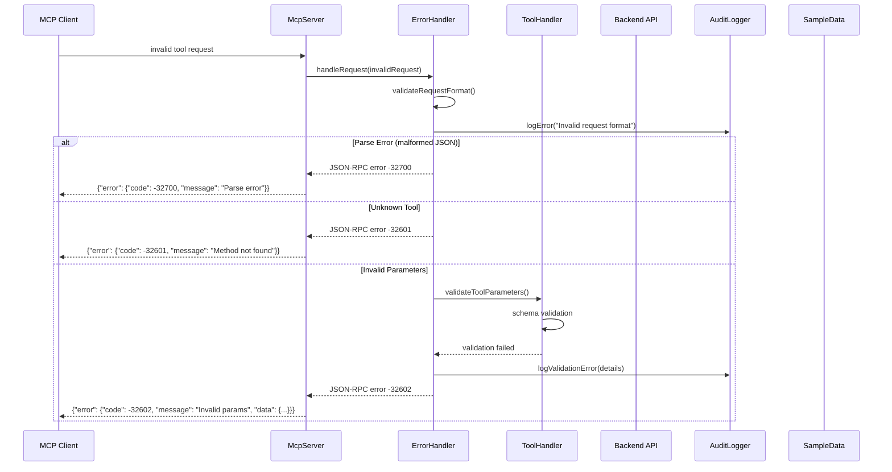
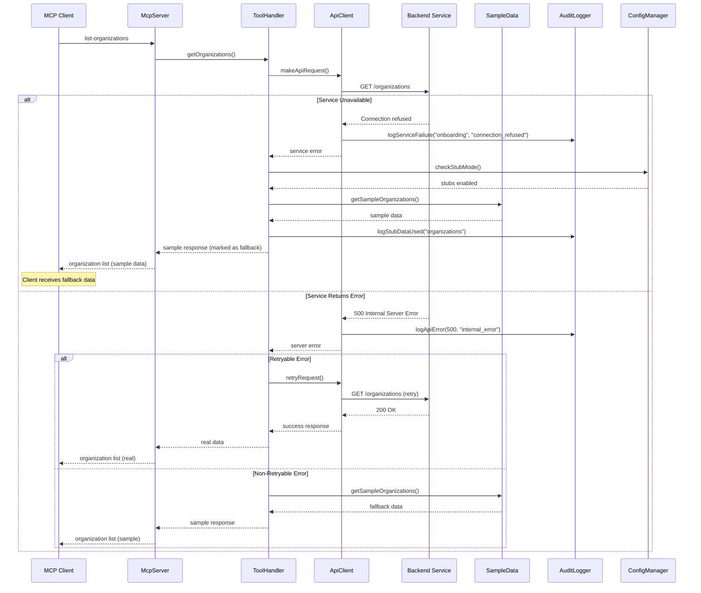
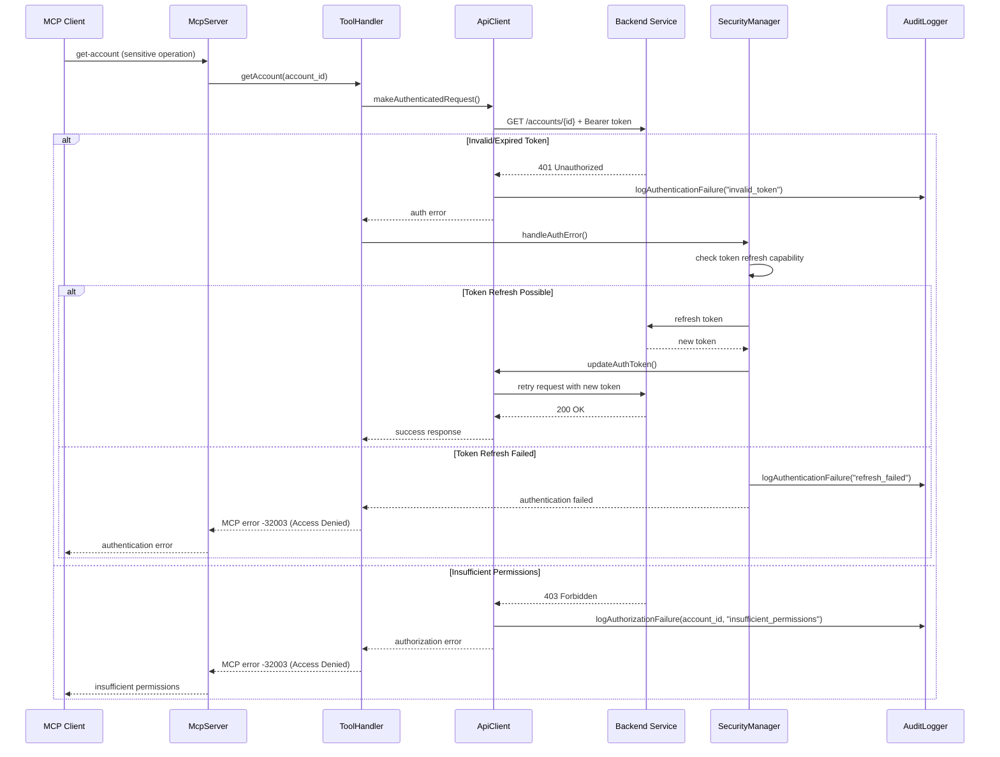
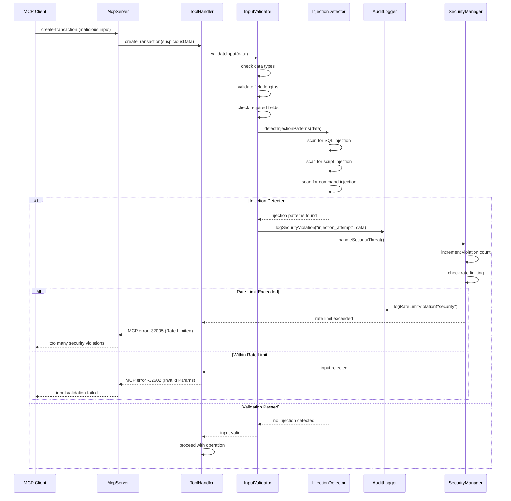
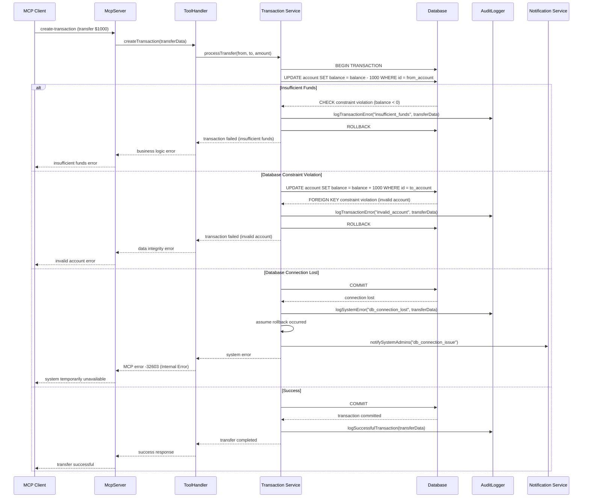
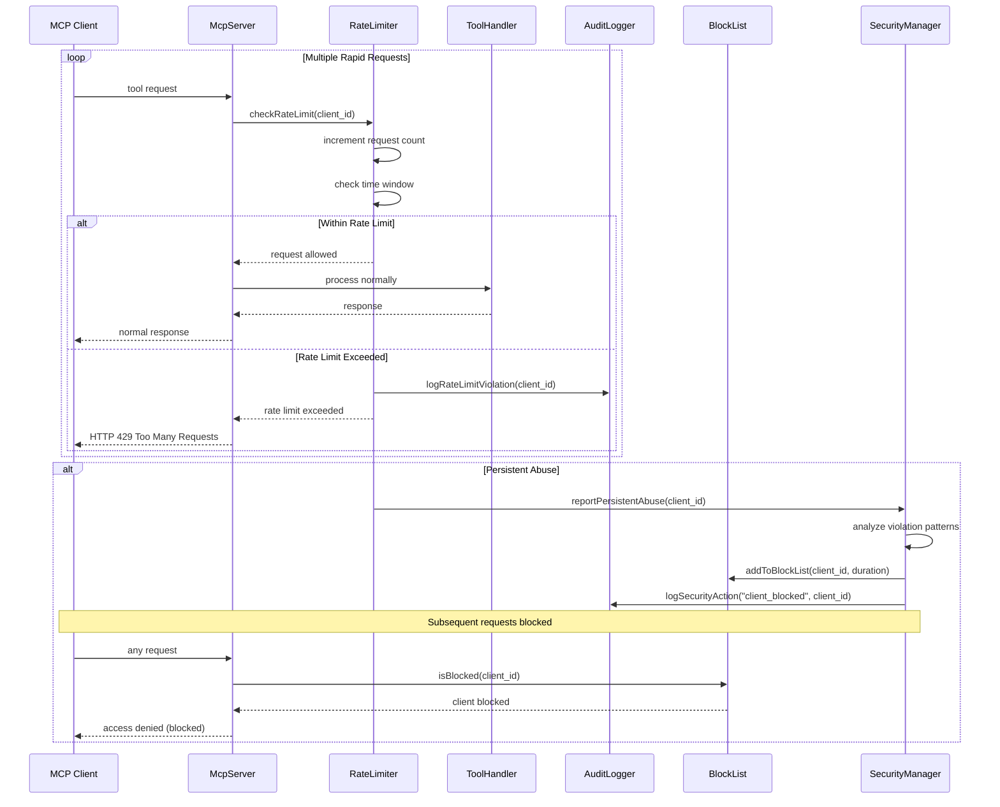
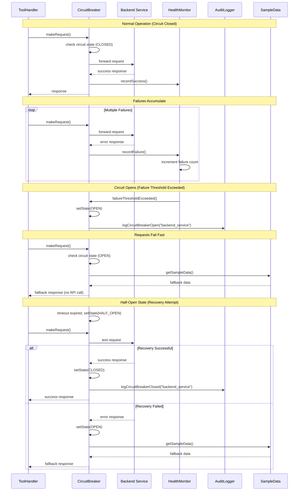

# Error Handling and Recovery Flow Diagrams

## Comprehensive Error Detection and Recovery

## Backend Service Failure and Fallback

## Authentication and Authorization Error Flow

## Input Validation and Injection Detection

## Transaction Rollback and Consistency

## Rate Limiting and Abuse Prevention

## Circuit Breaker Pattern for Service Health

