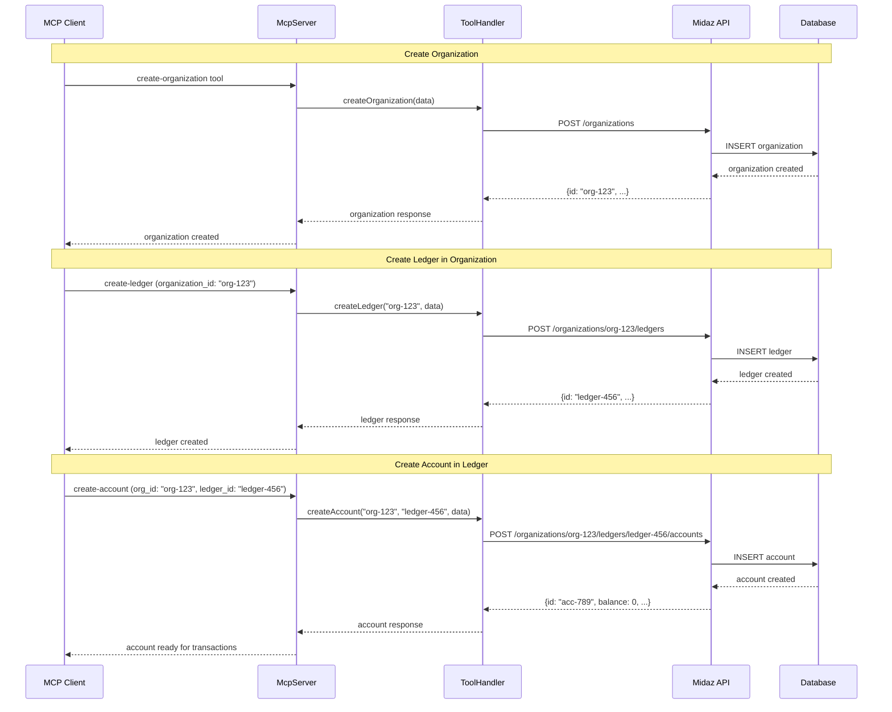
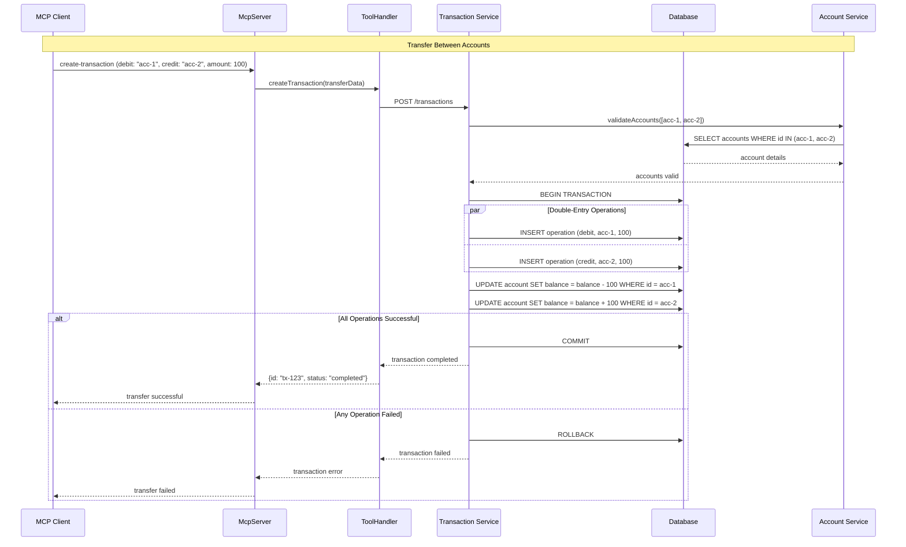
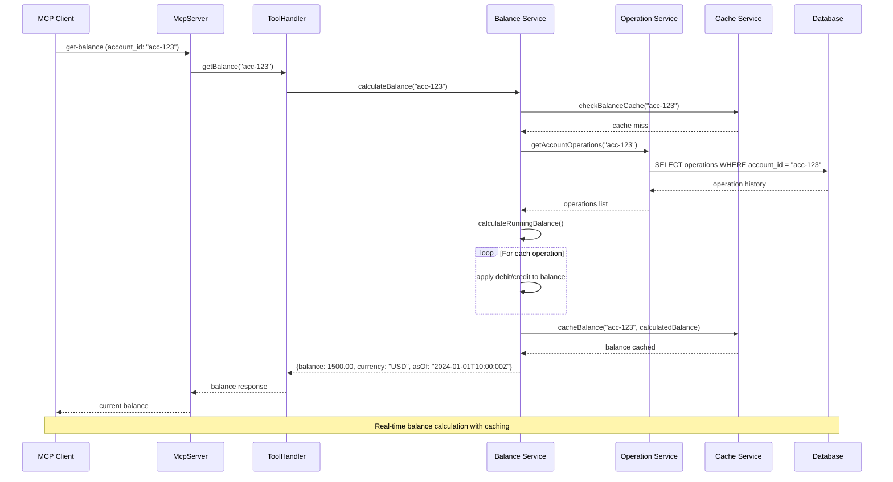
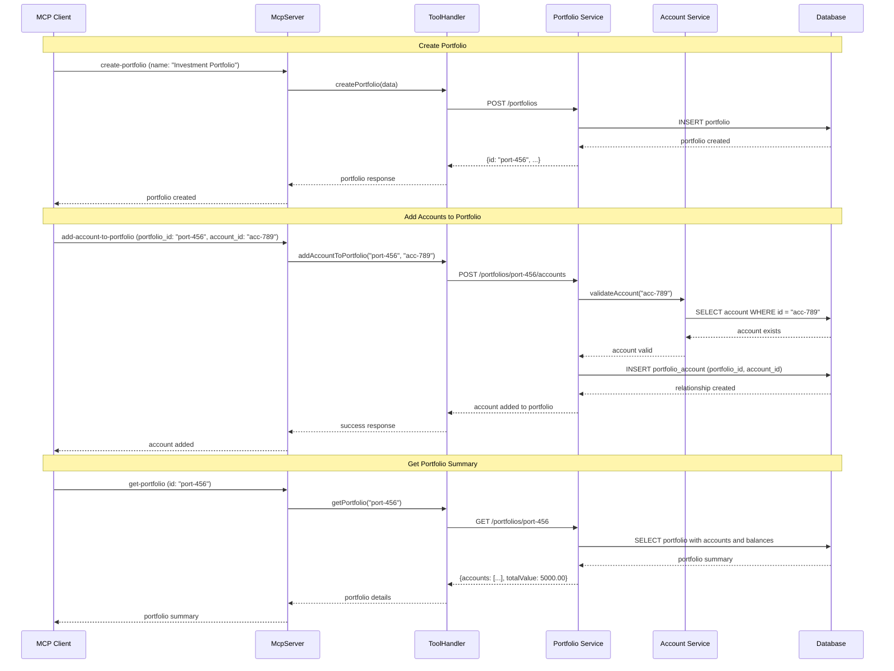
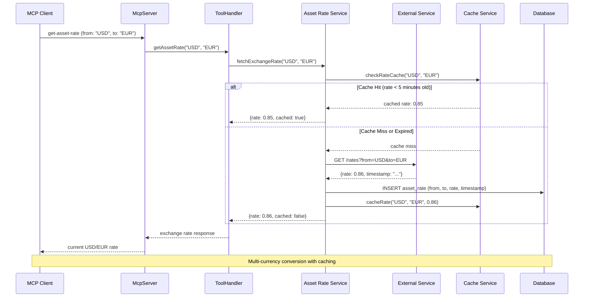
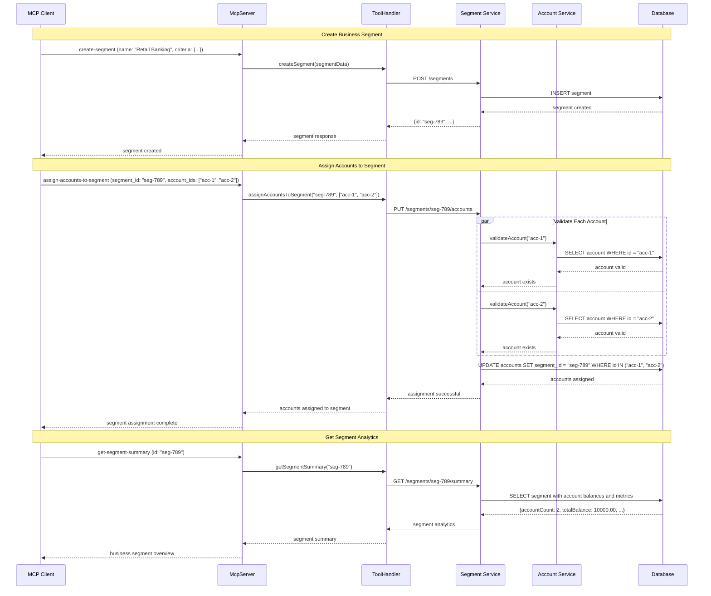

# Financial Workflow Diagrams

## Complete Financial Entity Creation Flow



## Double-Entry Transaction Processing



## Balance Inquiry and Calculation



## Portfolio Management Flow



## Asset Rate and Conversion Flow



## Financial Reporting and Analytics

```mermaid
sequenceDiagram
    participant C as MCP Client
    participant S as McpServer
    participant TH as ToolHandler
    participant RS as Reporting Service
    participant AS as Analytics Service
    participant DB as Database
    participant CS as Cache Service
    
    C->>S: generate-financial-report (account_id: "acc-123", period: "monthly")
    S->>TH: generateReport("acc-123", "monthly")
    TH->>RS: createFinancialReport("acc-123", "monthly")
    
    RS->>CS: checkReportCache("acc-123", "monthly")
    CS-->>RS: cache miss
    
    RS->>DB: SELECT transactions WHERE account_id = "acc-123" AND date >= start_date
    DB-->>RS: transaction history
    
    RS->>AS: calculateMetrics(transactions)
    AS->>AS: compute total debits
    AS->>AS: compute total credits
    AS->>AS: compute net change
    AS->>AS: compute average transaction size
    AS-->>RS: calculated metrics
    
    RS->>RS: formatReport(metrics)
    RS->>CS: cacheReport("acc-123", "monthly", report)
    
    RS-->>TH: {
        period: "monthly",
        totalDebits: 5000.00,
        totalCredits: 3000.00,
        netChange: -2000.00,
        transactionCount: 45,
        averageAmount: 177.78
    }
    TH-->>S: financial report
    S-->>C: comprehensive analytics
```

## Segment-Based Account Organization

