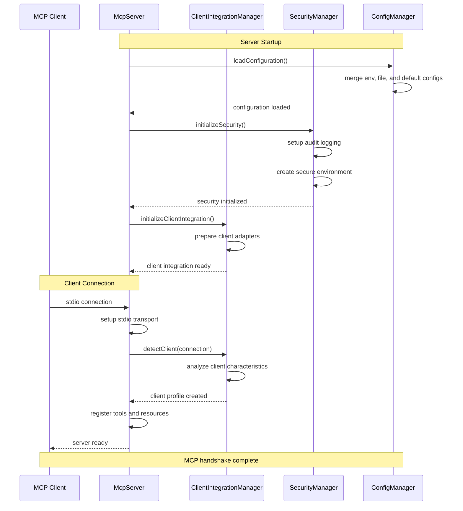
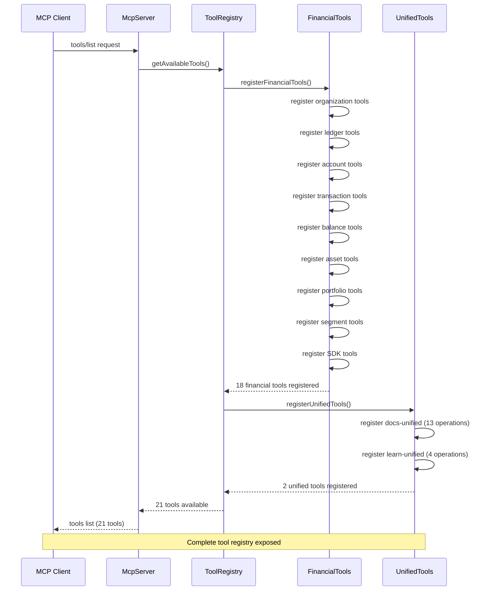
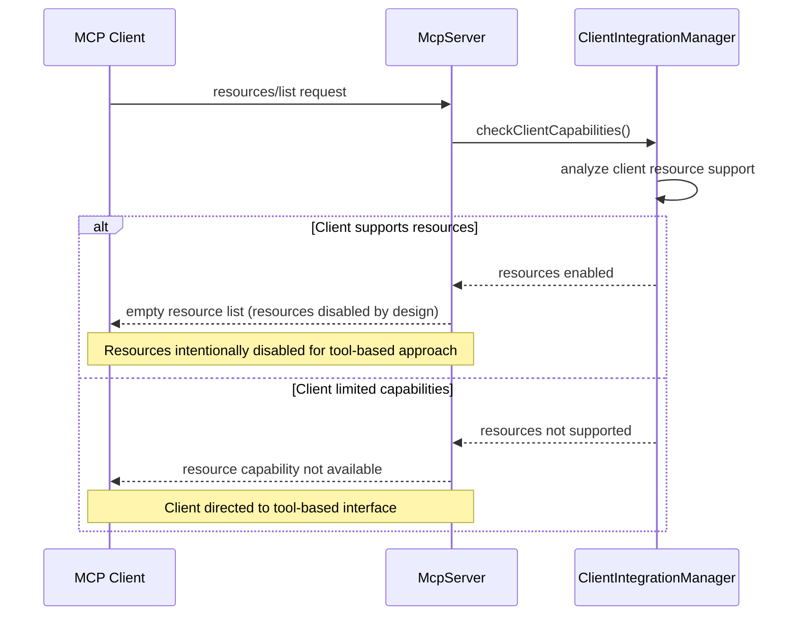
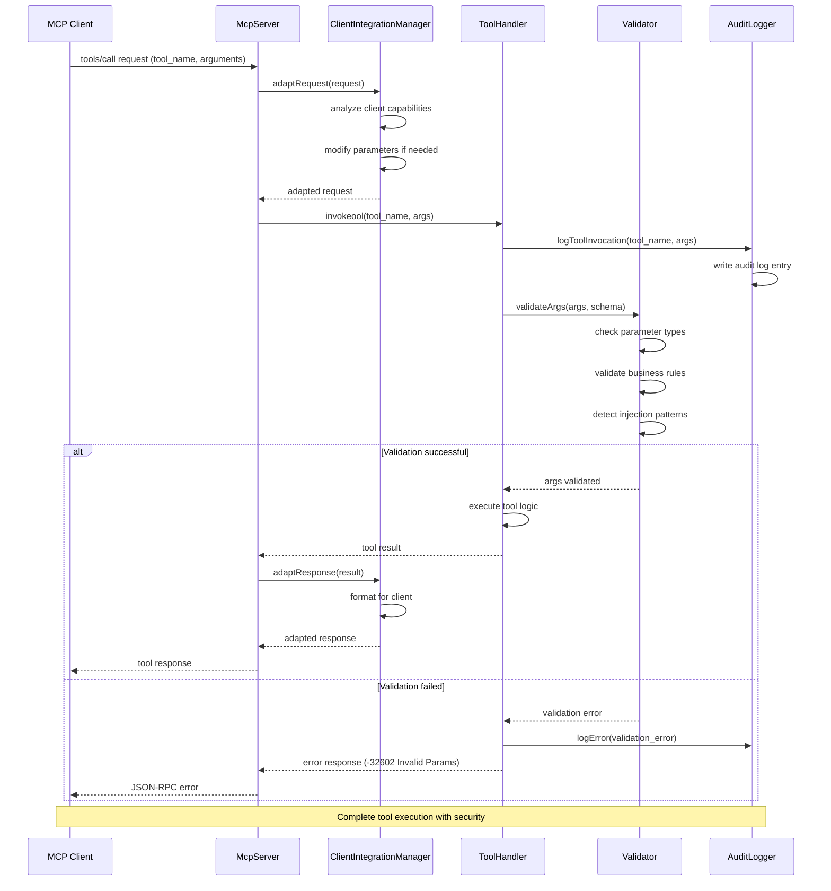
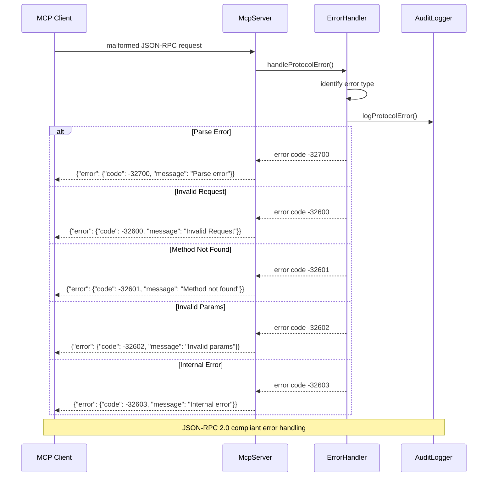
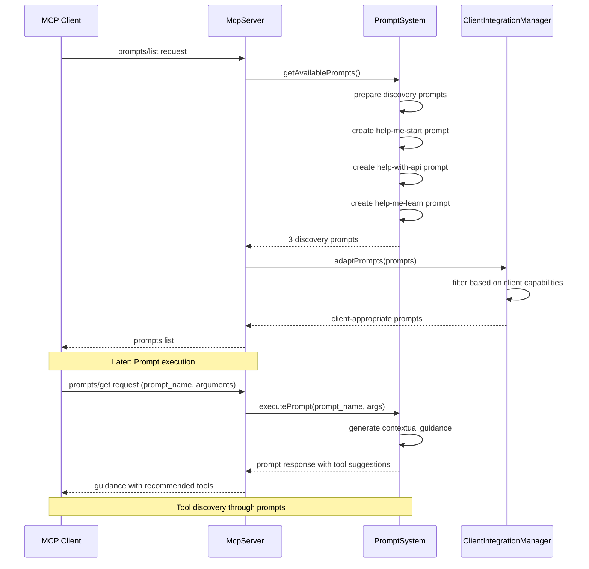
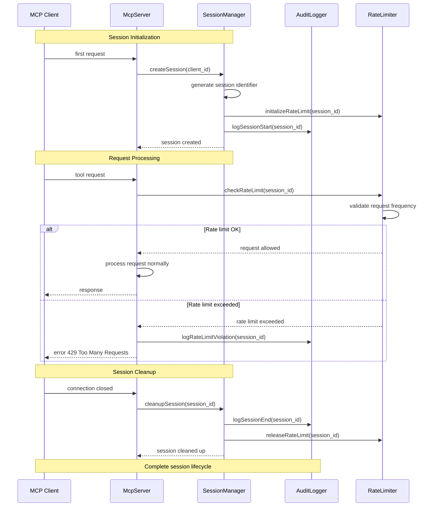

# MCP Protocol Flow Diagrams

## MCP Server Initialization and Client Connection

## Tool Discovery and Registration Flow

## Resource Discovery Flow

## Tool Invocation Flow

## MCP Protocol Error Handling

## Prompt System Flow

## Session Management Flow

